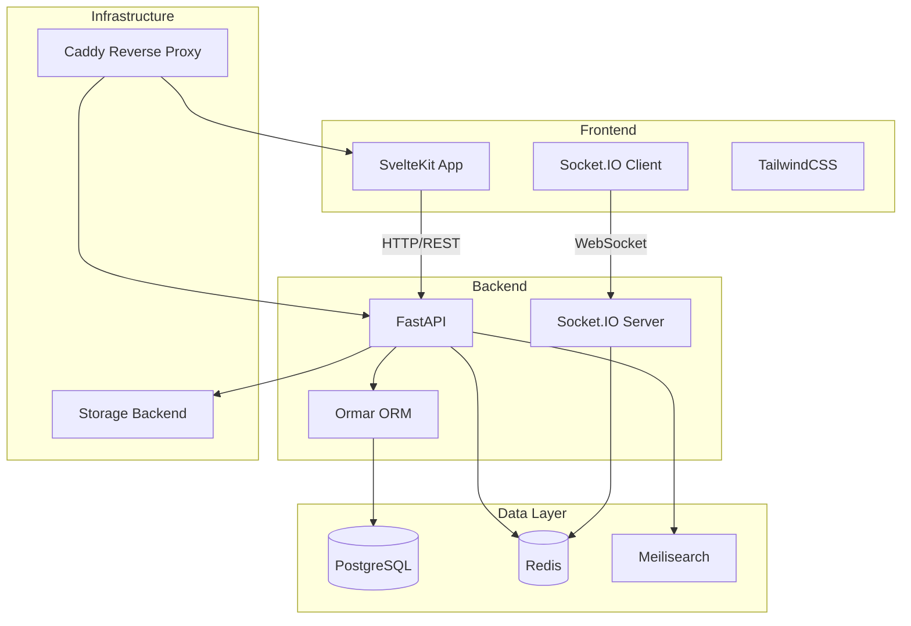
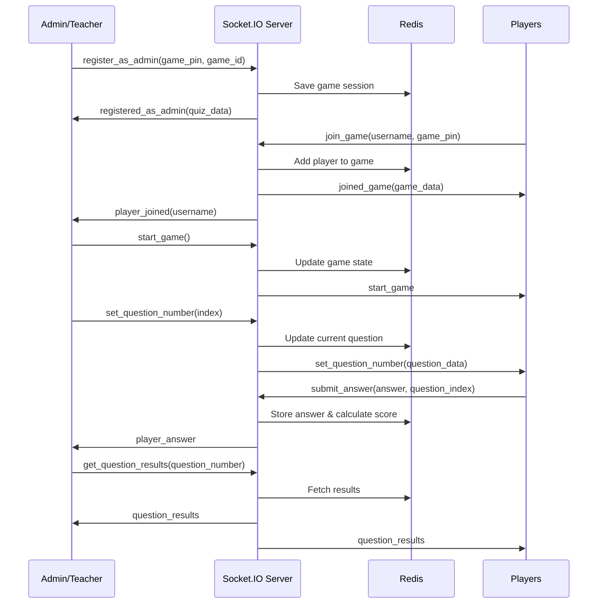

# System Architecture

ClassQuiz is built as a modern, real-time quiz platform using a monorepo structure with a FastAPI backend and SvelteKit frontend.

## High-Level Architecture



## Tech Stack

### Backend

The backend is built with Python and several key frameworks:

#### Core Framework
- **FastAPI** - Modern, high-performance web framework
  - Located in: `classquiz/__init__.py`
  - Provides REST API endpoints
  - Auto-generated OpenAPI docs at `/api/docs`

#### Database & ORM
- **PostgreSQL** - Primary database
- **Ormar** - Async ORM built on SQLAlchemy Core and Pydantic
  - Models defined in: `classquiz/db/models.py`
  - Supports async operations
  - Type-safe with Pydantic validation

#### Real-time Communication
- **python-socketio** - WebSocket implementation
  - Server implementation: `classquiz/socket_server/__init__.py`
  - Enables real-time game interactions
  - Handles player connections and game state

#### Caching & Sessions
- **Redis** - In-memory data store
  - Game state management
  - Session storage
  - Player data caching
  - Real-time leaderboards

#### Search
- **Meilisearch** - Fast, typo-tolerant search engine
  - Quiz and content search
  - Full-text search capabilities

### Frontend

The frontend is a modern JavaScript application:

#### Core Framework
- **SvelteKit** - Meta-framework for Svelte
  - Server-side rendering (SSR)
  - Static site generation
  - API routes
  - File-based routing

#### Styling
- **TailwindCSS** - Utility-first CSS framework
- **@tailwindcss/typography** - Typography plugin

#### Real-time Client
- **socket.io-client** (v4.8.1) - WebSocket client
  - Connects to Socket.IO server
  - Handles real-time game events

#### Key Libraries
- **i18next** - Internationalization
- **@sentry/browser** - Error tracking
- **qrcode** - QR code generation for game PINs
- **luxon** - Date/time handling
- **canvas-confetti** - Celebration effects
- **felte** - Form management
- **dompurify** - XSS protection

## Project Structure

```
ClassQuiz/
├── classquiz/                 # Backend Python package
│   ├── __init__.py           # FastAPI app initialization
│   ├── config.py             # Configuration and settings
│   ├── db/
│   │   └── models.py         # Database models (Ormar)
│   ├── routers/              # API route handlers
│   │   ├── users/
│   │   ├── quiz.py
│   │   ├── live.py
│   │   ├── storage.py
│   │   └── ...
│   ├── socket_server/        # Socket.IO implementation
│   │   ├── __init__.py       # Event handlers
│   │   ├── models.py         # Socket event models
│   │   └── helpers.py
│   ├── oauth.py              # Authentication
│   └── storage.py            # File storage abstraction
├── frontend/                  # SvelteKit frontend
│   ├── src/
│   │   ├── routes/           # SvelteKit routes
│   │   ├── lib/              # Shared components
│   │   └── app.html
│   ├── package.json
│   └── svelte.config.js
└── README.md
```

## Core Components

### API Routers

ClassQuiz organizes its REST API into modular routers:

```python
# From classquiz/__init__.py
app.include_router(users.router, prefix="/api/v1/users")
app.include_router(quiz.router, prefix="/api/v1/quiz")
app.include_router(live.router, prefix="/api/v1/live")
app.include_router(storage.router, prefix="/api/v1/storage")
app.include_router(search.router, prefix="/api/v1/search")
app.include_router(results.router, prefix="/api/v1/results")
app.include_router(community.router, prefix="/api/v1/community")
# ... and more
```

### Configuration System

Settings are managed via Pydantic Settings (`classquiz/config.py`):

```python
class Settings(BaseSettings):
    root_address: str = "http://127.0.0.1:8000"
    redis: RedisDsn
    db_url: PostgresDsn
    secret_key: str
    
    # Optional features
    hcaptcha_key: str | None = None
    sentry_dsn: str | None = None
    
    # Search
    meilisearch_url: str = "http://127.0.0.1:7700"
    
    # OAuth providers
    google_client_id: str | None = None
    github_client_id: str | None = None
    
    # Storage backend (local or S3)
    storage_backend: str
    storage_path: str | None = None
```

### Middleware Stack

FastAPI middleware handles:
1. **Session Management** - Starlette SessionMiddleware
2. **Authentication** - Custom remember-me middleware
3. **Error Tracking** - Sentry exception capture

```python
# Session middleware
app.add_middleware(SessionMiddleware, secret_key=settings.secret_key)

# Custom auth middleware
@app.middleware("http")
async def auth_middleware_wrapper(request: Request, call_next):
    return await rememberme_middleware(request, call_next)
```

## Data Flow

### Quiz Gameplay Flow



### Authentication Flow

1. User logs in via REST API (`/api/v1/login`)
2. JWT token generated with user claims
3. Token stored in HTTP-only cookie or localStorage
4. Middleware validates token on each request
5. Session management via Redis for Socket.IO connections

## Storage Architecture

ClassQuiz supports multiple storage backends:

### Local Storage
```python
storage_backend: "local"
storage_path: "/path/to/storage"
```

### S3-Compatible Storage
```python
storage_backend: "s3"
s3_access_key: "..."
s3_secret_key: "..."
s3_bucket_name: "classquiz"
s3_base_url: "https://..."
```

The abstraction layer (`classquiz/storage.py`) handles file uploads, downloads, and management regardless of backend.

## Security Features

### Authentication Options
- **Local** - Email/password with optional 2FA (TOTP)
- **WebAuthn/FIDO** - Passwordless authentication
- **OAuth2** - Google, GitHub, or custom OpenID providers

### Data Protection
- Password hashing
- CSRF protection via session middleware
- XSS prevention (DOMPurify on frontend)
- Rate limiting capabilities
- Optional hCaptcha/reCaptcha for game joins

## Deployment Architecture

### Recommended Stack
```
[Internet]
    |
[Caddy Reverse Proxy]
    |
    +-- [SvelteKit Frontend] (Port 3000)
    +-- [FastAPI Backend] (Port 8000)
        |
        +-- [PostgreSQL] (Port 5432)
        +-- [Redis] (Port 6379)
        +-- [Meilisearch] (Port 7700)
```

### Database Schema

The database uses PostgreSQL with these key tables:
- `users` - User accounts and authentication
- `quiz` - Quiz definitions and questions
- `game_results` - Completed game statistics
- `storage_items` - Uploaded media files
- `user_sessions` - Active user sessions
- `api_keys` - API authentication tokens

See [Database Models](/developer/database-models) for detailed schema documentation.

## Real-time Communication

Socket.IO handles all real-time features:
- Player join/leave notifications
- Question synchronization
- Answer submission
- Live leaderboards
- Game state updates
- Admin controls

See [Socket.IO Events](/developer/socket-events) for complete event reference.

## External Dependencies

### Self-hostable
- **PostgreSQL** - Primary database
- **Redis** - Cache and session store
- **Meilisearch** - Search functionality
- **Caddy** - Reverse proxy (or nginx/Apache)

### Optional Third-party Services
- **Mapbox** - Map-based questions
- **hCaptcha** - Bot protection
- **Sentry** - Error tracking
- **Pixabay** - Image search (requires API key)

## Performance Considerations

### Caching Strategy
- Redis caches frequently accessed data
- Game state stored in Redis for fast access
- Session data cached with 2-hour expiry
- Static assets served with cache headers

### Async Architecture
- FastAPI runs on ASGI (async) server
- Ormar provides async database queries
- Socket.IO uses async event handlers
- Non-blocking I/O throughout

### Scalability
- Stateless backend (session data in Redis)
- Horizontal scaling possible with load balancer
- Redis can be clustered for high availability
- PostgreSQL read replicas for read-heavy workloads

## Development Setup

For local development:

```bash
# Backend
pipenv install
pipenv run uvicorn classquiz:app --reload

# Frontend
cd frontend
npm install
npm run dev
```

See [Contributing](/developer/contributing) for full development guide.
