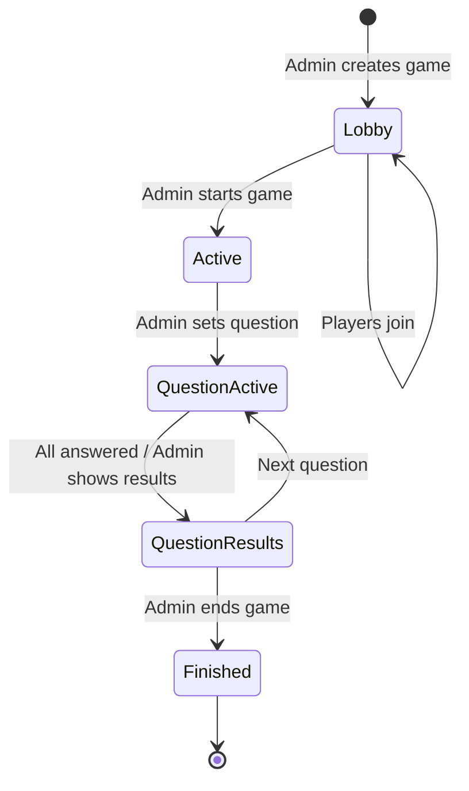

# Socket.IO Events Reference

ClassQuiz uses Socket.IO for real-time communication between the game admin (teacher) and players during quiz gameplay. This page documents all events, their payloads, and usage patterns.

## Connection

Socket.IO server is mounted at the root path and uses ASGI mode:

```python
# From classquiz/socket_server/__init__.py
sio = socketio.AsyncServer(async_mode="asgi", cors_allowed_origins=[])
```

Clients connect to the same domain as the API, and the connection is upgraded to WebSocket.

## Event Flow Overview

### Game Lifecycle



## Connection Events

### `connect`

**Direction:** Server → Client (automatic)

**When:** Client establishes Socket.IO connection

**Handler:**
```python
@sio.event
async def connect(sid: str, _environ, _auth):
    session_id = os.urandom(16).hex()
    sio_session = {"session_id": session_id}
    await sio.save_session(sid, sio_session)
    await sio.emit("session_id", ConnectSessionIdEvent(session_id=session_id).dict())
```

**Emits:** `session_id` event with session ID

### `session_id`

**Direction:** Server → Client

**Payload:**
```python
class ConnectSessionIdEvent(BaseModel):
    session_id: str
```

**Example:**
```json
{
  "session_id": "a3f5c8d9e2b4a6c8d9e2b4a6c8d9e2b4"
}
```

## Admin Events

These events are used by the quiz admin (teacher) to control the game.

### `register_as_admin`

**Direction:** Client → Server

**Purpose:** Register the client as the game admin

**Payload:**
```python
class RegisterAsAdminData(BaseModel):
    game_pin: str
    game_id: str
```

**Example:**
```json
{
  "game_pin": "45823169",
  "game_id": "d2923b0a-f02e-45b7-8876-268b473beb06"
}
```

**Response Events:**
- `registered_as_admin` - Success
- `already_registered_as_admin` - Another admin already exists
- `error` - Validation error

**Implementation:**
```python
@sio.event
async def register_as_admin(sid: str, data: dict):
    data = RegisterAsAdminData(**data)
    game_pin = data.game_pin
    game_id = data.game_id
    
    # Check if admin already exists
    if await redis.get(f"game_session:{game_pin}") is not None:
        await sio.emit("already_registered_as_admin", room=sid)
        return
    
    await GameSession(admin=sid, game_id=game_id, answers=[]).save(game_pin)
    await sio.emit(
        "registered_as_admin",
        {"game_id": game_id, "game": await redis.get(f"game:{game_pin}")},
        room=sid,
    )
    # Join admin room
    await sio.enter_room(sid, f"admin:{data.game_pin}")
```

### `registered_as_admin`

**Direction:** Server → Client

**Payload:**
```typescript
{
  game_id: string;
  game: {
    quiz_id: string;
    questions: QuizQuestion[];
    game_id: string;
    game_pin: string;
    started: boolean;
    title: string;
    description: string;
    // ... more fields
  };
}
```

### `start_game`

**Direction:** Client → Server

**Purpose:** Start the game and allow players to begin

**Payload:** Empty object `{}`

**Authorization:** Must be admin

**Implementation:**
```python
@sio.event
async def start_game(sid: str, _data: dict):
    session = await get_session(sid, sio)
    if not session["admin"]:
        return
    
    game_data = await PlayGame.get_from_redis(session["game_pin"])
    game_data.started = True
    await game_data.save(session["game_pin"])
    await redis.delete(f"game_in_lobby:{game_data.user_id.hex}")
    
    # Broadcast to all players
    await sio.emit("start_game", room=session["game_pin"])
```

**Broadcast:** `start_game` event sent to all players in the game room

### `set_question_number`

**Direction:** Client → Server

**Purpose:** Display a specific question to all players

**Payload:** String representation of question index
```typescript
"0"  // First question
"1"  // Second question
// etc.
```

**Authorization:** Must be admin

**Implementation:**
```python
@sio.event
async def set_question_number(sid: str, data: str):
    session = await get_session(sid, sio)
    if not session["admin"]:
        return
    
    game_pin = session["game_pin"]
    game_data = await PlayGame.get_from_redis(session["game_pin"])
    game_data.current_question = int(float(data))
    game_data.question_show = True
    await game_data.save(session["game_pin"])
    
    # Record question start time
    await redis.set(
        f"game:{session['game_pin']}:current_time",
        datetime.now().isoformat(),
        ex=7200
    )
    
    question = game_data.questions[int(float(data))]
    
    # Broadcast to all players
    await sio.emit(
        "set_question_number",
        {
            "question_index": int(float(data)),
            "question": ReturnQuestion(**question.dict()).model_dump(),
        },
        room=game_pin,
    )
```

**Question Types:**
- `ABCD` - Multiple choice
- `RANGE` - Numeric range
- `VOTING` - Vote for options
- `SLIDE` - Information slide (no answer)
- `TEXT` - Text input
- `ORDER` - Order items correctly
- `CHECK` - Multiple correct answers

**Broadcast Event:**
```typescript
{
  question_index: number;
  question: {
    question: string;
    time: string;  // Duration in seconds
    type: QuestionType;
    answers: Answer[];  // Type depends on question type
    image?: string;
  };
}
```

### `get_question_results`

**Direction:** Client → Server

**Purpose:** Retrieve and display results for a specific question

**Payload:**
```json
{
  "question_number": "0"
}
```

**Authorization:** Must be admin

**Implementation:**
```python
@sio.event
async def get_question_results(sid: str, data: dict):
    session = await get_session(sid, sio)
    if not session["admin"]:
        return
    
    game_pin = session["game_pin"]
    answer_data_list = await AnswerDataList.get_redis_or_empty(
        game_pin,
        data["question_number"]
    )
    
    game_data = await PlayGame.get_from_redis(game_pin)
    game_data.question_show = False
    await game_data.save(game_pin)
    
    # Broadcast results to everyone
    await sio.emit("question_results", answer_data_list.model_dump(), room=game_pin)
```

**Response Event:** `question_results`

### `question_results`

**Direction:** Server → Client (broadcast)

**Payload:**
```python
class AnswerData(BaseModel):
    username: str
    answer: str
    right: bool
    time_taken: float  # Milliseconds
    score: int

class AnswerDataList(RootModel):
    root: list[AnswerData]
```

**Example:**
```json
[
  {
    "username": "Alice",
    "answer": "Paris",
    "right": true,
    "time_taken": 2345.67,
    "score": 876
  },
  {
    "username": "Bob",
    "answer": "London",
    "right": false,
    "time_taken": 1234.56,
    "score": 0
  }
]
```

### `show_solutions`

**Direction:** Client → Server

**Purpose:** Display the correct answers to all players

**Payload:** Empty object `{}`

**Authorization:** Must be admin

**Implementation:**
```python
@sio.event
async def show_solutions(sid: str, _data: dict):
    session = await get_session(sid, sio)
    if not session["admin"]:
        return
    
    game_data = await PlayGame.get_from_redis(session["game_pin"])
    await sio.emit(
        "solutions",
        game_data.questions[game_data.current_question].model_dump(),
        room=session["game_pin"],
    )
```

**Broadcast Event:** `solutions` with full question data including correct answers

### `get_final_results`

**Direction:** Client → Server

**Purpose:** Get complete game results with all questions

**Payload:** Empty object `{}`

**Authorization:** Must be admin

**Implementation:**
```python
@sio.event
async def get_final_results(sid: str, _data: dict):
    session = await get_session(sid, sio)
    if not session["admin"]:
        return
    
    game_data = await PlayGame.get_from_redis(session["game_pin"])
    results = await generate_final_results(game_data, session["game_pin"])
    
    await sio.emit("final_results", results, room=session["game_pin"])
```

**Response Event:** `final_results`

**Payload Format:**
```typescript
{
  "0": AnswerData[],  // Results for question 0
  "1": AnswerData[],  // Results for question 1
  // ... etc
}
```

### `kick_player`

**Direction:** Client → Server

**Purpose:** Remove a player from the game

**Payload:**
```python
class KickPlayerInput(BaseModel):
    username: str
```

**Example:**
```json
{
  "username": "troublemaker123"
}
```

**Authorization:** Must be admin

**Implementation:**
```python
@sio.event
async def kick_player(sid: str, data: dict):
    data = KickPlayerInput(**data)
    session = await get_session(sid, sio)
    if not session["admin"]:
        return
    
    player_sid = await redis.get(
        f"game_session:{session['game_pin']}:players:{data.username}"
    )
    await redis.srem(
        f"game_session:{session['game_pin']}:players",
        GamePlayer(username=data.username, sid=player_sid).model_dump_json(),
    )
    await sio.leave_room(player_sid, session["game_pin"])
    await sio.emit("kick", room=player_sid)
```

**Player Receives:** `kick` event (signals they were removed)

### `save_quiz`

**Direction:** Client → Server

**Purpose:** Save game results to persistent storage

**Payload:** Empty object `{}`

**Authorization:** Must be admin

**Implementation:**
```python
@sio.event
async def save_quiz(sid: str):
    session = await get_session(sid, sio)
    if not session["admin"]:
        return
    
    await save_quiz_to_storage(session["game_pin"])
    await sio.emit("results_saved_successfully")
```

**Response:** `results_saved_successfully` event

### `get_export_token`

**Direction:** Client → Server

**Purpose:** Get a token to export game results

**Payload:** None

**Authorization:** Must be admin

**Implementation:**
```python
@sio.event
async def get_export_token(sid: str):
    session = await get_session(sid, sio)
    if not session["admin"]:
        return
    
    game_data = await PlayGame.get_from_redis(session["game_pin"])
    results = await generate_final_results(game_data, session["game_pin"])
    
    token = os.urandom(32).hex()
    await redis.set(f"export_token:{token}", json.dumps(results), ex=7200)
    await sio.emit("export_token", token, room=sid)
```

**Response:** `export_token` event with token string (expires in 2 hours)

## Player Events

These events are used by players participating in the quiz.

### `join_game`

**Direction:** Client → Server

**Purpose:** Join a game with a username and game PIN

**Payload:**
```python
class JoinGameData(BaseModel):
    username: str
    game_pin: str
    captcha: str | None = None
    custom_field: str | None = None
```

**Example:**
```json
{
  "username": "StudentName",
  "game_pin": "45823169",
  "captcha": "captcha_token_here",
  "custom_field": "Class 5B"
}
```

**Validation:**
- Game must exist
- Game must not be started
- Username must be unique in the game
- Captcha required if `captcha_enabled` is true

**Implementation:**
```python
@sio.event
async def join_game(sid: str, data: dict):
    data = JoinGameData(**data)
    redis_res = await redis.get(f"game:{data.game_pin}")
    
    if redis_res is None:
        await sio.emit("game_not_found", room=sid)
        return
    
    game_data = PlayGame.model_validate_json(redis_res)
    
    if game_data.started:
        await sio.emit("game_already_started", room=sid)
        return
    
    # Check captcha if enabled
    if game_data.captcha_enabled:
        if not check_captcha(data.captcha):
            return
    
    # Check username uniqueness
    if await redis.get(f"game_session:{data.game_pin}:players:{data.username}") is not None:
        await sio.emit("username_already_exists", room=sid)
        return
    
    # Save session and add to game
    session = {
        "game_pin": data.game_pin,
        "username": data.username,
        "sid_custom": sid,
        "admin": False,
    }
    await save_session(sid, sio, session)
    
    # Emit success to player
    await sio.emit("joined_game", game_data.to_player_data(), room=sid)
    
    # Store player data
    await redis.set(
        f"game_session:{data.game_pin}:players:{data.username}",
        sid,
        ex=7200
    )
    await GamePlayer(username=data.username, sid=sid).to_player_stack(data.game_pin)
    
    # Notify admin
    await sio.emit(
        "player_joined",
        {"username": data.username, "sid": sid},
        room=f"admin:{data.game_pin}",
    )
    
    # Time sync
    encrypted_datetime = fernet.encrypt(datetime.now().isoformat().encode("utf-8")).decode("utf-8")
    await sio.emit("time_sync", encrypted_datetime, room=sid)
    
    await sio.enter_room(sid, data.game_pin)
```

**Response Events:**
- `joined_game` - Success
- `game_not_found` - Invalid game PIN
- `game_already_started` - Game in progress
- `username_already_exists` - Username taken
- `error` - Validation error

**Notifications:**
- Admin receives `player_joined` event

### `joined_game`

**Direction:** Server → Client

**Payload:** Game data without sensitive information
```typescript
{
  game_id: string;
  game_pin: string;
  started: boolean;
  title: string;
  description: string;
  question_count: number;
  cover_image?: string;
  background_color?: string;
  // ... (excludes quiz_id, questions, user_id)
}
```

### `rejoin_game`

**Direction:** Client → Server

**Purpose:** Reconnect to a game after disconnection

**Payload:**
```python
class RejoinGameData(BaseModel):
    old_sid: str
    game_pin: str
    username: str
```

**Example:**
```json
{
  "old_sid": "abc123xyz",
  "game_pin": "45823169",
  "username": "StudentName"
}
```

**Implementation:**
```python
@sio.event
async def rejoin_game(sid: str, data: dict):
    data = RejoinGameData(**data)
    redis_res = await redis.get(f"game:{data.game_pin}")
    
    if redis_res is None:
        await sio.emit("game_not_found", room=sid)
        return
    
    # Verify old session
    redis_sid_key = f"game_session:{data.game_pin}:players:{data.username}"
    old_sid = await redis.get(redis_sid_key)
    if old_sid != data.old_sid:
        return
    
    # Update session ID
    await redis.set(redis_sid_key, sid)
    
    # Update player in game
    await redis.srem(
        f"game_session:{data.game_pin}:players",
        GamePlayer(username=data.username, sid=data.old_sid).model_dump_json(),
    )
    await redis.sadd(
        f"game_session:{data.game_pin}:players",
        GamePlayer(username=data.username, sid=sid).model_dump_json(),
    )
    
    game_data = PlayGame.model_validate_json(redis_res)
    
    await sio.emit("rejoined_game", game_data.to_player_data(), room=sid)
    await sio.enter_room(sid, data.game_pin)
```

**Response:** `rejoined_game` event with current game state

### `submit_answer`

**Direction:** Client → Server

**Purpose:** Submit an answer for the current question

**Payload:**
```python
class SubmitAnswerData(BaseModel):
    question_index: int
    answer: str | int
    complex_answer: list[SubmitAnswerDataOrderType] | None = None
```

**Examples:**
```json
// ABCD question
{
  "question_index": 0,
  "answer": "2"  // Index of selected answer
}

// Range question
{
  "question_index": 1,
  "answer": 42
}

// Text question
{
  "question_index": 2,
  "answer": "Paris"
}

// Order question
{
  "question_index": 3,
  "answer": "order",
  "complex_answer": [
    {"answer": "First"},
    {"answer": "Second"},
    {"answer": "Third"}
  ]
}
```

**Score Calculation:**
```python
def calculate_score(z: float, t: int) -> int:
    """Calculate score based on time taken.
    
    Args:
        z: Time taken in milliseconds
        t: Total time allowed in seconds
    
    Returns:
        Score from 0 to 1000
    """
    t = t * 1000  # Convert to milliseconds
    res = (t - z) / t
    return int(res * 1000)
```

**Implementation:**
```python
@sio.event
async def submit_answer(sid: str, data: dict):
    now = datetime.now()
    data = SubmitAnswerData(**data)
    session = await get_session(sid, sio)
    question_index = int(float(data.question_index))
    
    game_data = await PlayGame.get_from_redis(session["game_pin"])
    
    # Check if already answered
    already_answered = await has_already_answered(
        session["game_pin"],
        question_index,
        session["username"]
    )
    if already_answered:
        await sio.emit("already_replied", room=sid)
        return
    
    # Check answer correctness
    answer_right, answer = check_answer(game_data, data)
    
    # Calculate score with latency compensation
    latency = int(float(session["ping"]))
    time_q_started = datetime.fromisoformat(
        await redis.get(f"game:{session['game_pin']}:current_time")
    )
    diff = (time_q_started - now).total_seconds() * 1000
    
    score = 0
    if answer_right:
        score = calculate_score(
            abs(diff) - latency,
            int(float(game_data.questions[question_index].time)),
        )
        if score > 1000:
            score = 1000
    
    # Update player score
    await redis.hincrby(
        f"game_session:{session['game_pin']}:player_scores",
        session["username"],
        score
    )
    
    # Store answer
    answer_data = AnswerData(
        username=session["username"],
        answer=answer,
        right=answer_right,
        time_taken=abs(diff) - latency,
        score=score,
    )
    await set_answer(
        await redis.get(f"game_session:{session['game_pin']}:{data.question_index}"),
        game_pin=session["game_pin"],
        data=answer_data,
        q_index=question_index,
    )
    
    await sio.emit("player_answer", {})
    
    # Check if everyone answered
    player_count = await redis.scard(f"game_session:{session['game_pin']}:players")
    if len(answers) == player_count:
        game_data.question_show = False
        await game_data.save(session["game_pin"])
        await sio.emit("everyone_answered", {})
```

**Response Events:**
- `player_answer` - Acknowledgement
- `already_replied` - Already submitted for this question
- `everyone_answered` - All players have answered (broadcast)

### `player_joined`

**Direction:** Server → Client (admin only)

**Purpose:** Notify admin that a player joined

**Payload:**
```json
{
  "username": "StudentName",
  "sid": "socket_id_here"
}
```

## Synchronization Events

### `time_sync`

**Direction:** Server → Client

**Purpose:** Synchronize time between server and client for accurate scoring

**Payload:** Encrypted ISO timestamp string

**Implementation:**
```python
# Server sends encrypted timestamp
encrypted_datetime = fernet.encrypt(
    datetime.now().isoformat().encode("utf-8")
).decode("utf-8")
await sio.emit("time_sync", encrypted_datetime, room=sid)
```

**Response:** Client should emit `echo_time_sync` with same encrypted string

### `echo_time_sync`

**Direction:** Client → Server

**Purpose:** Echo encrypted timestamp back to calculate latency

**Payload:** The encrypted timestamp received in `time_sync`

**Implementation:**
```python
@sio.event
async def echo_time_sync(sid: str, data: str):
    then_dec = fernet.decrypt(data).decode("utf-8")
    then = datetime.fromisoformat(then_dec)
    now = datetime.now()
    delta = now - then
    
    session = await get_session(sid, sio)
    session["ping"] = delta.microseconds / 1000  # Store latency in ms
    await save_session(sid, sio, session)
```

**Effect:** Updates session with client's latency for score compensation

## Remote Control Events

### `register_as_remote`

**Direction:** Client → Server

**Purpose:** Register as remote controller (e.g., mobile device controlling presentation)

**Payload:**
```python
class _RegisterAsRemoteInput(BaseModel):
    game_pin: str
    game_id: str
```

**Implementation:**
```python
@sio.event
async def register_as_remote(sid: str, data: dict):
    data = _RegisterAsRemoteInput(**data)
    await sio.emit(
        "registered_as_admin",
        {"game_id": data.game_id, "game": await redis.get(f"game:{data.game_pin}")},
        room=sid,
    )
    
    # Hide controls on main admin screen
    await sio.emit(
        "control_visibility",
        {"visible": False},
        room=f"admin:{data.game_pin}"
    )
    
    session = await get_session(sid, sio)
    session["game_pin"] = data.game_pin
    session["admin"] = True
    session["remote"] = True
    await save_session(sid, sio, session)
    
    await sio.enter_room(sid, data.game_pin)
    await sio.enter_room(sid, f"admin:{data.game_pin}")
```

### `set_control_visibility`

**Direction:** Client → Server

**Purpose:** Show/hide controls on admin screen (for remote control mode)

**Payload:**
```python
class _SetControlVisibilityInput(BaseModel):
    visible: bool
```

**Example:**
```json
{
  "visible": false
}
```

**Broadcast:** `control_visibility` event to admin room

## Error Events

### `error`

**Direction:** Server → Client

**Payload:** None or error details

**When:** Validation errors, malformed data, or unexpected errors

### `game_not_found`

**Direction:** Server → Client

**Payload:** None

**When:** Invalid game PIN provided

### `game_already_started`

**Direction:** Server → Client

**Payload:** None

**When:** Player tries to join a game that's already in progress

### `username_already_exists`

**Direction:** Server → Client

**Payload:** None

**When:** Player tries to join with a username already in use

### `already_registered_as_admin`

**Direction:** Server → Client

**Payload:** None

**When:** Another admin is already registered for the game

### `already_replied`

**Direction:** Server → Client

**Payload:** None

**When:** Player tries to submit multiple answers for the same question

### `kick`

**Direction:** Server → Client

**Payload:** None

**When:** Player was kicked by admin

## Room System

Socket.IO rooms organize clients:

### Game Room
- **Name:** `{game_pin}` (e.g., `"45823169"`)
- **Members:** All players + admin
- **Purpose:** Broadcast game events to everyone

### Admin Room
- **Name:** `admin:{game_pin}` (e.g., `"admin:45823169"`)
- **Members:** Game admin(s) only
- **Purpose:** Admin-specific notifications (e.g., player joins)

## Redis Data Structure

Socket.IO uses Redis for state management:

```python
# Game data
f"game:{game_pin}" → PlayGame (JSON)

# Game session
f"game_session:{game_pin}" → GameSession (JSON)

# Player sessions
f"game_session:{game_pin}:players:{username}" → socket_id (string)

# Player list
f"game_session:{game_pin}:players" → Set[GamePlayer] (set)

# Answers for each question
f"game_session:{game_pin}:{question_index}" → AnswerDataList (JSON)

# Player scores
f"game_session:{game_pin}:player_scores" → Hash[username → score]

# Current question time
f"game:{game_pin}:current_time" → ISO timestamp (string)

# Custom fields (optional)
f"game:{game_pin}:players:custom_fields" → Hash[username → field_value]

# Export tokens
f"export_token:{token}" → results (JSON, expires in 2 hours)
```

## Client Implementation Example

```typescript
import { io } from 'socket.io-client';

const socket = io();

// Admin flow
socket.emit('register_as_admin', {
  game_pin: '12345678',
  game_id: 'uuid-here'
});

socket.on('registered_as_admin', (data) => {
  console.log('Registered as admin', data);
});

socket.on('player_joined', ({ username }) => {
  console.log(`${username} joined!`);
});

socket.emit('start_game', {});

socket.emit('set_question_number', '0');

socket.emit('get_question_results', { question_number: '0' });

socket.on('question_results', (results) => {
  console.log('Results:', results);
});

// Player flow
socket.emit('join_game', {
  username: 'Alice',
  game_pin: '12345678'
});

socket.on('joined_game', (gameData) => {
  console.log('Joined game:', gameData);
});

socket.on('set_question_number', ({ question_index, question }) => {
  console.log(`Question ${question_index}:`, question);
});

socket.emit('submit_answer', {
  question_index: 0,
  answer: '2'
});

socket.on('player_answer', () => {
  console.log('Answer submitted!');
});

// Time sync
socket.on('time_sync', (encrypted) => {
  socket.emit('echo_time_sync', encrypted);
});
```

## Best Practices

### Error Handling
Always handle error events:
```typescript
socket.on('error', () => {
  // Show error message
});

socket.on('game_not_found', () => {
  // Invalid game PIN
});
```

### Reconnection
Implement reconnection logic:
```typescript
socket.on('disconnect', () => {
  // Store old_sid for rejoin
  localStorage.setItem('old_sid', socket.id);
});

socket.on('connect', () => {
  const oldSid = localStorage.getItem('old_sid');
  if (oldSid && inGame) {
    socket.emit('rejoin_game', {
      old_sid: oldSid,
      game_pin: gamePin,
      username: username
    });
  }
});
```

### Time Synchronization
Always respond to time_sync for accurate scoring:
```typescript
socket.on('time_sync', (encrypted) => {
  socket.emit('echo_time_sync', encrypted);
});
```

### Authorization
The server checks authorization for admin events:
- Events are ignored if `session["admin"]` is not `True`
- No error is returned to prevent information disclosure

### Session Management
Sessions are stored in Socket.IO's session system:
```python
session = {
    "game_pin": str,
    "username": str,  # For players
    "admin": bool,
    "remote": bool,   # For remote controllers
    "ping": float,    # Latency in milliseconds
}
```
