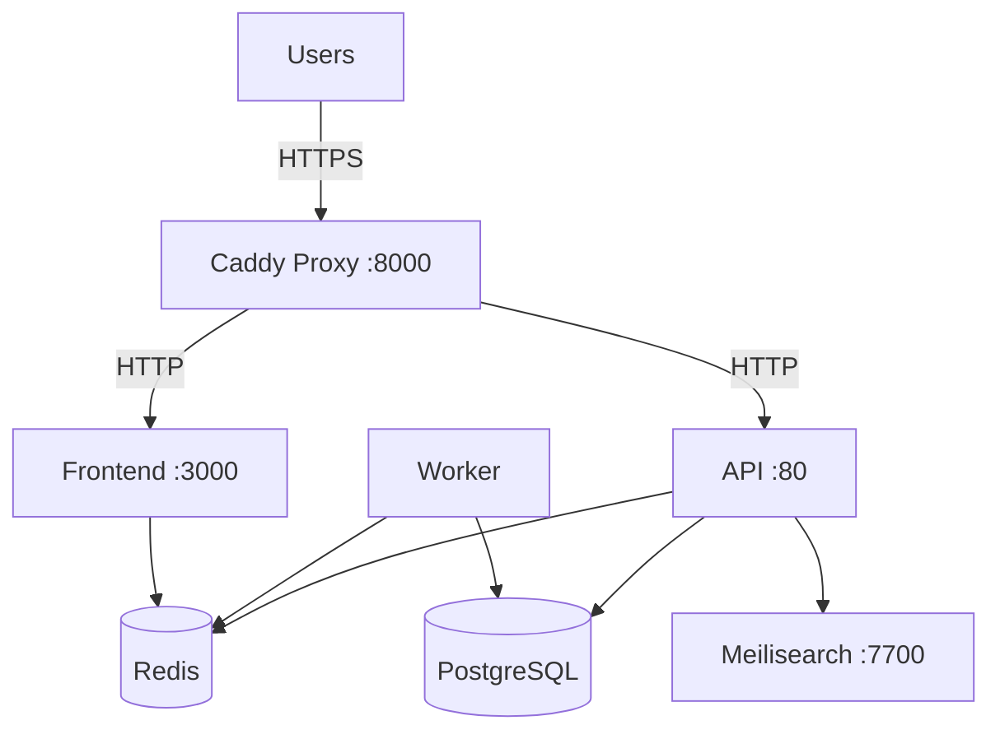

## Overview

ClassQuiz is fully open-source under the Mozilla Public License 2.0, enabling you to host your own instance with complete control over your data and customization.

<Warning>
  **License Compliance**: The MPL 2.0 license requires you to publish any modifications you make to the source code. This is a strict requirement, not optional.
</Warning>

<Note>
  While official releases are available, the maintainer recommends running the latest commit from the `master` branch where CI checks pass, as it contains the most recent bug fixes and improvements.
</Note>

## Prerequisites

### Required Software

<CardGroup cols={2}>
  <Card title="Docker & Docker Compose" icon="docker">
    Container orchestration for all services
  </Card>
  <Card title="Git" icon="git-alt">
    Version control to clone the repository
  </Card>
  <Card title="OpenSSL" icon="lock">
    For generating secure secret keys
  </Card>
  <Card title="SSL Certificate" icon="shield">
    HTTPS is required for proper WebSocket functionality
  </Card>
</CardGroup>

### System Requirements

- **CPU**: 2+ cores recommended
- **RAM**: 4GB minimum, 8GB+ recommended for production
- **Storage**: 10GB+ depending on media uploads
- **Network**: Public IP address or domain name with SSL

### Optional Third-Party Services

<AccordionGroup>
  <Accordion title="Email Service (SMTP)">
    Required for user registration and email verification.
    - Configure any SMTP server (Gmail, SendGrid, Mailgun, etc.)
    - Default: Email verification can be disabled
  </Accordion>

  <Accordion title="OAuth Providers">
    Enable single sign-on for users:
    - **Google OAuth**: [console.cloud.google.com](https://console.cloud.google.com/apis/dashboard)
    - **GitHub OAuth**: [github.com/settings/developers](https://github.com/settings/developers)
    - **Custom OpenID**: Any OpenID Connect provider
  </Accordion>

  <Accordion title="Captcha Service">
    Prevent spam registrations:
    - **hCaptcha**: [hcaptcha.com](https://hcaptcha.com)
    - **reCAPTCHA**: [google.com/recaptcha](https://www.google.com/recaptcha/about/)
  </Accordion>

  <Accordion title="Image Search">
    Enable image search in quiz editor:
    - **Pixabay API**: [pixabay.com/api/docs](https://pixabay.com/api/docs/)
  </Accordion>

  <Accordion title="Error Tracking">
    Monitor application errors:
    - **Sentry**: [sentry.io](https://sentry.io)
  </Accordion>
</AccordionGroup>

## Installation

<Steps>
  <Step title="Clone the Repository">
    ```bash
    git clone https://github.com/mawoka-myblock/ClassQuiz.git
    cd ClassQuiz
    ```

    <Tip>
      For production deployments, consider using a specific commit or tag for stability:
      ```bash
      git checkout <commit-hash>
      ```
    </Tip>
  </Step>

  <Step title="Configure Frontend Build">
    Edit `frontend/Dockerfile` to set build-time environment variables:

    ```dockerfile
    # Captcha Configuration
    ENV VITE_HCAPTCHA=your_hcaptcha_sitekey_here
    ENV VITE_CAPTCHA_ENABLED=true

    # OAuth Configuration
    ENV VITE_GOOGLE_AUTH_ENABLED=true
    ENV VITE_GITHUB_AUTH_ENABLED=true
    ENV VITE_CUSTOM_OAUTH_NAME="School SSO"

    # Optional: Error Tracking
    ENV VITE_SENTRY=your_sentry_dsn_here
    ```

    <Warning>
      These are **build-time** variables. Changes require rebuilding the frontend container:
      ```bash
      docker compose build frontend
      ```
    </Warning>

    ### Frontend Environment Variables

    | Variable | Required | Description |
    |----------|----------|-------------|
    | `VITE_HCAPTCHA` | No | hCaptcha site key for captcha challenges |
    | `VITE_CAPTCHA_ENABLED` | No | Set to `true` to enable captcha on registration |
    | `VITE_GOOGLE_AUTH_ENABLED` | No | Set to `true` to show Google login button |
    | `VITE_GITHUB_AUTH_ENABLED` | No | Set to `true` to show GitHub login button |
    | `VITE_CUSTOM_OAUTH_NAME` | No | Display name for custom OpenID provider |
    | `VITE_SENTRY` | No | Sentry DSN for frontend error tracking |
  </Step>

  <Step title="Configure Backend Services">
    Edit the `docker-compose.yml` file to configure the API and worker services.

    ### Essential Configuration

    <CodeGroup>
    ```yaml docker-compose.yml
    environment:
      # ===== REQUIRED: Change These Values =====
      
      # Your public domain (no trailing slash)
      ROOT_ADDRESS: "https://classquiz.yourdomain.com"
      
      # Generate with: openssl rand -hex 32
      SECRET_KEY: "TOP_SECRET"  # CHANGE THIS!
      
      # ===== Email Configuration =====
      MAIL_SERVER: "smtp.gmail.com"
      MAIL_PORT: "587"
      MAIL_USERNAME: "your-email@gmail.com"
      MAIL_PASSWORD: "your-app-password"
      MAIL_ADDRESS: "your-email@gmail.com"
      SKIP_EMAIL_VERIFICATION: "False"  # Set to "True" to disable email verification
      
      # ===== Storage Backend =====
      STORAGE_BACKEND: "local"  # Options: "local" or "s3"
      STORAGE_PATH: "/app/data"  # Required if STORAGE_BACKEND=local
    ```
    </CodeGroup>

    ### Generate Secure Secret Key

    Run this command to automatically generate and set a secure secret:

    ```bash
    sed -i "s/TOP_SECRET/$(openssl rand -hex 32)/g" docker-compose.yml
    ```

    <Warning>
      **Never use the default `TOP_SECRET` value in production!** This would allow attackers to forge authentication tokens.
    </Warning>
  </Step>

  <Step title="Configure Storage Backend">
    ClassQuiz requires a storage backend for uploaded media files.

    <Tabs>
      <Tab title="Local Filesystem">
        **Recommended for**: Small deployments, single-server setups

        ```yaml docker-compose.yml
        environment:
          STORAGE_BACKEND: "local"
          STORAGE_PATH: "/app/data"
        
        volumes:
          - ./uploads:/app/data  # Persist uploads on host
        ```

        <Note>
          Local storage stores files directly on the server filesystem. Ensure the `./uploads` directory has appropriate permissions.
        </Note>
      </Tab>

      <Tab title="S3-Compatible Storage">
        **Recommended for**: Large deployments, horizontal scaling, CDN integration

        ```yaml docker-compose.yml
        environment:
          STORAGE_BACKEND: "s3"
          S3_ACCESS_KEY: "your-access-key"
          S3_SECRET_KEY: "your-secret-key"
          S3_BASE_URL: "https://s3.amazonaws.com"  # Or your Minio URL
          S3_BUCKET_NAME: "classquiz"  # Default bucket name
        ```

        Compatible with:
        - Amazon S3
        - MinIO (self-hosted)
        - DigitalOcean Spaces
        - Backblaze B2
        - Any S3-compatible service

        <Tip>
          For self-hosted MinIO, add it to your `docker-compose.yml`:
          ```yaml
          minio:
            image: minio/minio
            command: server /data --console-address ":9001"
            environment:
              MINIO_ROOT_USER: minioadmin
              MINIO_ROOT_PASSWORD: minioadmin
            ports:
              - "9000:9000"
              - "9001:9001"
            volumes:
              - minio-data:/data
          ```
        </Tip>
      </Tab>
    </Tabs>
  </Step>

  <Step title="Configure OAuth (Optional)">
    Enable third-party authentication for easier user registration.

    <Tabs>
      <Tab title="Google OAuth">
        1. Visit [Google Cloud Console](https://console.cloud.google.com/apis/dashboard)
        2. Create a new project or select existing
        3. Navigate to **APIs & Services** > **OAuth consent screen**
        4. Configure consent screen with your application details
        5. Go to **Credentials** > **Create Credentials** > **OAuth Client ID**
        6. Set application type to **Web application**
        7. Add **Authorized JavaScript origins**:
           ```
           https://classquiz.yourdomain.com
           ```
        8. Add **Authorized redirect URIs**:
           ```
           https://classquiz.yourdomain.com/api/v1/users/oauth/google/auth
           ```
        9. Copy the **Client ID** and **Client Secret**

        Add to `docker-compose.yml`:
        ```yaml
        environment:
          GOOGLE_CLIENT_ID: "your-client-id.apps.googleusercontent.com"
          GOOGLE_CLIENT_SECRET: "your-client-secret"
        ```

        Update `frontend/Dockerfile`:
        ```dockerfile
        ENV VITE_GOOGLE_AUTH_ENABLED=true
        ```
      </Tab>

      <Tab title="GitHub OAuth">
        1. Visit [GitHub Developer Settings](https://github.com/settings/developers)
        2. Click **New OAuth App**
        3. Fill in application details:
           - **Homepage URL**: `https://classquiz.yourdomain.com`
           - **Authorization callback URL**: `https://classquiz.yourdomain.com/api/v1/users/oauth/github/auth`
        4. Click **Register application**
        5. Generate a new **Client Secret**
        6. Copy the **Client ID** and **Client Secret**

        Add to `docker-compose.yml`:
        ```yaml
        environment:
          GITHUB_CLIENT_ID: "your-github-client-id"
          GITHUB_CLIENT_SECRET: "your-github-client-secret"
        ```

        Update `frontend/Dockerfile`:
        ```dockerfile
        ENV VITE_GITHUB_AUTH_ENABLED=true
        ```
      </Tab>

      <Tab title="Custom OpenID">
        Configure any OpenID Connect-compliant provider.

        Add to `docker-compose.yml`:
        ```yaml
        environment:
          CUSTOM_OPENID_PROVIDER__CLIENT_ID: "your-client-id"
          CUSTOM_OPENID_PROVIDER__CLIENT_SECRET: "your-client-secret"
          CUSTOM_OPENID_PROVIDER__SERVER_METADATA_URL: "https://provider.com/.well-known/openid-configuration"
        ```

        Set redirect URI in your provider to:
        ```
        https://classquiz.yourdomain.com/api/v1/users/oauth/custom/auth
        ```

        Update `frontend/Dockerfile`:
        ```dockerfile
        ENV VITE_CUSTOM_OAUTH_NAME="Your Provider Name"
        ```

        <Note>
          The default scopes requested are: `openid email profile`
        </Note>
      </Tab>
    </Tabs>
  </Step>

  <Step title="Configure Advanced Options">
    ### Captcha Protection

    ```yaml
    environment:
      # Choose ONE captcha provider
      HCAPTCHA_KEY: "your-hcaptcha-secret"     # hCaptcha (recommended)
      # OR
      RECAPTCHA_KEY: "your-recaptcha-secret"   # Google reCAPTCHA
    ```

    Remember to also set the site key in `frontend/Dockerfile`.

    ### Image Search

    Enable Pixabay integration for quiz images:
    ```yaml
    environment:
      PIXABAY_API_KEY: "your-pixabay-api-key"
    ```

    Get your key at [pixabay.com/api/docs](https://pixabay.com/api/docs/)

    ### Error Tracking

    ```yaml
    environment:
      SENTRY_DSN: "https://your-sentry-dsn@sentry.io/project-id"
    ```

    ### Storage Limits

    ```yaml
    environment:
      FREE_STORAGE_LIMIT: "1074000000"  # 1GB in bytes
    ```

    ### Admin and Moderation

    ```yaml
    environment:
      MODS: '["user1@example.com", "user2@example.com"]'  # JSON array of moderator emails
      REGISTRATION_DISABLED: "false"  # Set to "true" to disable new registrations
    ```

    ### Token Expiration

    ```yaml
    environment:
      ACCESS_TOKEN_EXPIRE_MINUTES: 30  # Default: 30 minutes
      CACHE_EXPIRY: 86400              # Default: 24 hours (in seconds)
    ```
  </Step>

  <Step title="Build and Deploy">
    ### Build Containers

    ```bash
    docker compose build
    ```

    This builds:
    - **frontend**: SvelteKit frontend (Node.js)
    - **api**: FastAPI backend (Python)
    - **worker**: ARQ background worker (Python)

    ### Start Services

    ```bash
    docker compose up -d
    ```

    This starts all services:
    - `frontend` (port 3000)
    - `api` (port 80)
    - `worker`
    - `db` (PostgreSQL)
    - `redis` (cache and queue)
    - `meilisearch` (search engine)
    - `proxy` (Caddy reverse proxy on port 8000)

    ### Verify Deployment

    ```bash
    # Check all containers are running
    docker compose ps

    # View logs
    docker compose logs -f

    # Check specific service
    docker compose logs -f api
    ```

    <Note>
      The Caddy proxy listens on port **8000** by default. Change this in `docker-compose.yml` under the `proxy` service:
      ```yaml
      ports:
        - "8080:8080"  # Change 8000 to your preferred port
      ```
    </Note>
  </Step>

  <Step title="Configure Reverse Proxy & SSL">
    ClassQuiz **requires HTTPS** for proper WebSocket and OAuth functionality.

    <Tabs>
      <Tab title="Using External Nginx">
        ```nginx /etc/nginx/sites-available/classquiz
        server {
            listen 80;
            server_name classquiz.yourdomain.com;
            return 301 https://$server_name$request_uri;
        }

        server {
            listen 443 ssl http2;
            server_name classquiz.yourdomain.com;

            ssl_certificate /path/to/cert.pem;
            ssl_certificate_key /path/to/key.pem;

            # WebSocket support
            location /socket.io/ {
                proxy_pass http://localhost:8000;
                proxy_http_version 1.1;
                proxy_set_header Upgrade $http_upgrade;
                proxy_set_header Connection "upgrade";
                proxy_set_header Host $host;
                proxy_set_header X-Real-IP $remote_addr;
                proxy_set_header X-Forwarded-For $proxy_add_x_forwarded_for;
                proxy_set_header X-Forwarded-Proto $scheme;
            }

            # API endpoints
            location /api/ {
                proxy_pass http://localhost:8000;
                proxy_set_header Host $host;
                proxy_set_header X-Real-IP $remote_addr;
                proxy_set_header X-Forwarded-For $proxy_add_x_forwarded_for;
                proxy_set_header X-Forwarded-Proto $scheme;
            }

            # Frontend
            location / {
                proxy_pass http://localhost:8000;
                proxy_set_header Host $host;
                proxy_set_header X-Real-IP $remote_addr;
                proxy_set_header X-Forwarded-For $proxy_add_x_forwarded_for;
                proxy_set_header X-Forwarded-Proto $scheme;
            }
        }
        ```
      </Tab>

      <Tab title="Using Caddy (Standalone)">
        If you prefer to manage SSL with an external Caddy instance:

        ```caddyfile /etc/caddy/Caddyfile
        classquiz.yourdomain.com {
            reverse_proxy localhost:8000
        }
        ```

        Caddy automatically obtains and renews SSL certificates from Let's Encrypt.
      </Tab>

      <Tab title="Using Internal Caddy">
        The included Caddy proxy can handle SSL if you modify `Caddyfile-docker`:

        ```caddyfile Caddyfile-docker
        classquiz.yourdomain.com {
            reverse_proxy * http://frontend:3000
            reverse_proxy /api/* http://api:80
            reverse_proxy /openapi.json http://api:80
            reverse_proxy /socket.io/* api:80
        }
        ```

        Update `docker-compose.yml`:
        ```yaml
        proxy:
          image: caddy:alpine
          restart: always
          volumes:
            - ./Caddyfile-docker:/etc/caddy/Caddyfile
            - caddy-data:/data
            - caddy-config:/config
          ports:
            - "80:80"
            - "443:443"
        
        volumes:
          data:
          meilisearch-data:
          caddy-data:
          caddy-config:
        ```
      </Tab>
    </Tabs>
  </Step>
</Steps>

## Architecture Overview

### Services



### Tech Stack

<CardGroup cols={2}>
  <Card title="Frontend" icon="code">
    - **SvelteKit**: Modern web framework
    - **TailwindCSS**: Utility-first CSS
    - **Socket.IO**: Real-time communication
  </Card>
  <Card title="Backend" icon="server">
    - **FastAPI**: High-performance Python API
    - **Ormar**: Async ORM
    - **ARQ**: Background task queue
  </Card>
  <Card title="Database" icon="database">
    - **PostgreSQL**: Primary database
    - **Redis**: Caching and queues
    - **Meilisearch**: Full-text search
  </Card>
  <Card title="Infrastructure" icon="cloud">
    - **Docker**: Containerization
    - **Caddy**: Reverse proxy
    - **S3**: Optional object storage
  </Card>
</CardGroup>

## Environment Variables Reference

### Database & Cache (Do Not Change)

| Variable | Default | Description |
|----------|---------|-------------|
| `DB_URL` | `postgresql://postgres:classquiz@db:5432/classquiz` | PostgreSQL connection string |
| `REDIS` | `redis://redis:6379/0?decode_responses=True` | Redis connection string |
| `MEILISEARCH_URL` | `http://meilisearch:7700` | Meilisearch endpoint |
| `MAX_WORKERS` | `1` | Worker pool size (keep at 1) |

### Required Configuration

| Variable | Required | Description |
|----------|----------|-------------|
| `ROOT_ADDRESS` | **Yes** | Public URL (no trailing slash) |
| `SECRET_KEY` | **Yes** | 32+ character secret for JWT signing |
| `STORAGE_BACKEND` | **Yes** | `local` or `s3` |

### Email Configuration

| Variable | Required | Description |
|----------|----------|-------------|
| `MAIL_SERVER` | Yes | SMTP server hostname |
| `MAIL_PORT` | Yes | SMTP server port (587 for TLS) |
| `MAIL_USERNAME` | Yes | SMTP authentication username |
| `MAIL_PASSWORD` | Yes | SMTP authentication password |
| `MAIL_ADDRESS` | Yes | Sender email address |
| `SKIP_EMAIL_VERIFICATION` | No | Set to `True` to disable email verification |

### Storage Configuration

| Variable | Required | Description |
|----------|----------|-------------|
| `STORAGE_PATH` | If `STORAGE_BACKEND=local` | Absolute path for file storage |
| `S3_ACCESS_KEY` | If `STORAGE_BACKEND=s3` | S3 access key |
| `S3_SECRET_KEY` | If `STORAGE_BACKEND=s3` | S3 secret key |
| `S3_BASE_URL` | If `STORAGE_BACKEND=s3` | S3 endpoint URL |
| `S3_BUCKET_NAME` | No | S3 bucket name (default: `classquiz`) |

### OAuth Configuration

| Variable | Required | Description |
|----------|----------|-------------|
| `GOOGLE_CLIENT_ID` | No | Google OAuth client ID |
| `GOOGLE_CLIENT_SECRET` | No | Google OAuth client secret |
| `GITHUB_CLIENT_ID` | No | GitHub OAuth client ID |
| `GITHUB_CLIENT_SECRET` | No | GitHub OAuth client secret |
| `CUSTOM_OPENID_PROVIDER__CLIENT_ID` | No | Custom OIDC client ID |
| `CUSTOM_OPENID_PROVIDER__CLIENT_SECRET` | No | Custom OIDC client secret |
| `CUSTOM_OPENID_PROVIDER__SERVER_METADATA_URL` | No | OIDC discovery URL |

### Optional Features

| Variable | Required | Description |
|----------|----------|-------------|
| `HCAPTCHA_KEY` | No | hCaptcha secret key |
| `RECAPTCHA_KEY` | No | reCAPTCHA secret key |
| `PIXABAY_API_KEY` | No | Pixabay API key for image search |
| `SENTRY_DSN` | No | Sentry error tracking DSN |
| `TELEMETRY_ENABLED` | No | Enable usage telemetry (default: `true`) |
| `FREE_STORAGE_LIMIT` | No | Storage quota in bytes (default: 1GB) |
| `MODS` | No | JSON array of moderator emails |
| `REGISTRATION_DISABLED` | No | Disable new registrations |

## Maintenance

### Updating ClassQuiz

```bash
# Pull latest changes
git pull origin master

# Rebuild and restart
docker compose down
docker compose build
docker compose up -d
```

### Database Backups

```bash
# Backup PostgreSQL
docker compose exec db pg_dump -U postgres classquiz > backup.sql

# Restore from backup
docker compose exec -T db psql -U postgres classquiz < backup.sql
```

### View Logs

```bash
# All services
docker compose logs -f

# Specific service
docker compose logs -f api

# Last 100 lines
docker compose logs --tail=100 api
```

### Restart Services

```bash
# Restart all
docker compose restart

# Restart specific service
docker compose restart api
```

### Clean Up

```bash
# Remove containers and networks (preserves data)
docker compose down

# Remove everything including volumes (DATA LOSS!)
docker compose down -v
```

## Troubleshooting

<AccordionGroup>
  <Accordion title="OAuth Login Fails">
    **Symptoms**: Redirect loops, OAuth errors

    **Solutions**:
    1. Ensure `ROOT_ADDRESS` matches your public URL exactly (no trailing slash)
    2. Verify redirect URIs in OAuth provider match exactly
    3. Confirm HTTPS is enabled (OAuth requires secure connections)
    4. Check that `VITE_GOOGLE_AUTH_ENABLED` or `VITE_GITHUB_AUTH_ENABLED` is set in `frontend/Dockerfile`
    5. Rebuild frontend after environment variable changes:
       ```bash
       docker compose build frontend
       docker compose up -d frontend
       ```
  </Accordion>

  <Accordion title="WebSocket Connection Errors">
    **Symptoms**: "Connection refused" in browser console, games don't start

    **Solutions**:
    1. Ensure reverse proxy forwards `/socket.io/*` to the API
    2. Verify WebSocket upgrade headers are set:
       ```
       Upgrade: websocket
       Connection: upgrade
       ```
    3. Check that HTTPS is enabled (WebSocket over HTTP fails in production)
    4. Test WebSocket endpoint:
       ```bash
       curl -i -N -H "Connection: Upgrade" -H "Upgrade: websocket" \
         https://classquiz.yourdomain.com/socket.io/
       ```
  </Accordion>

  <Accordion title="Email Verification Not Working">
    **Symptoms**: Users don't receive verification emails

    **Solutions**:
    1. Verify SMTP credentials in `docker-compose.yml`
    2. Check API logs for email errors:
       ```bash
       docker compose logs api | grep -i mail
       ```
    3. Ensure firewall allows outbound SMTP (port 587 or 465)
    4. Test SMTP connection:
       ```bash
       docker compose exec api python -c "import smtplib; s=smtplib.SMTP('smtp.gmail.com', 587); s.starttls(); s.login('user', 'pass'); print('OK')"
       ```
    5. Temporarily disable verification for testing:
       ```yaml
       SKIP_EMAIL_VERIFICATION: "True"
       ```
  </Accordion>

  <Accordion title="File Upload Errors">
    **Symptoms**: "Storage error" when uploading media

    **Solutions**:
    1. **Local storage**: Check directory permissions
       ```bash
       chmod -R 755 ./uploads
       docker compose restart api
       ```
    2. **S3 storage**: Verify credentials and bucket access
       ```bash
       docker compose exec api python -c "from classquiz.storage import Storage; s = Storage(...); print(s.test_connection())"
       ```
    3. Check storage limit:
       ```yaml
       FREE_STORAGE_LIMIT: "5368709120"  # Increase to 5GB
       ```
    4. Verify allowed MIME types (source: `classquiz/config.py:109`):
       - Images: PNG, JPEG, GIF, WebP
       - Videos: MP4
  </Accordion>

  <Accordion title="Database Migration Errors">
    **Symptoms**: "Table doesn't exist" errors

    **Solutions**:
    1. Run migrations manually:
       ```bash
       docker compose exec api alembic upgrade head
       ```
    2. Check migration status:
       ```bash
       docker compose exec api alembic current
       ```
    3. If migrations fail, check database connectivity:
       ```bash
       docker compose exec api python -c "from classquiz.db.models import db; print(db.database.url)"
       ```
  </Accordion>

  <Accordion title="Search Not Working">
    **Symptoms**: Quiz search returns no results

    **Solutions**:
    1. Check Meilisearch status:
       ```bash
       docker compose ps meilisearch
       docker compose logs meilisearch
       ```
    2. Rebuild search index:
       ```bash
       docker compose exec api python -c "from classquiz.helpers.search import rebuild_index; rebuild_index()"
       ```
    3. Verify Meilisearch connection:
       ```bash
       curl http://localhost:7700/health
       ```
  </Accordion>
</AccordionGroup>

## Security Best Practices

<CardGroup cols={2}>
  <Card title="Secret Management" icon="key">
    - Generate unique `SECRET_KEY` for each deployment
    - Never commit secrets to version control
    - Rotate secrets periodically
    - Use environment files with restricted permissions
  </Card>
  <Card title="Network Security" icon="shield">
    - Always use HTTPS in production
    - Restrict database access to Docker network
    - Keep services updated
    - Enable fail2ban for brute-force protection
  </Card>
  <Card title="Access Control" icon="lock">
    - Set up moderators with `MODS` variable
    - Disable registration if running private instance
    - Enable captcha to prevent spam
    - Review OAuth scopes carefully
  </Card>
  <Card title="Backups" icon="floppy-disk">
    - Backup database daily
    - Store media backups separately
    - Test restoration procedures
    - Keep backups encrypted
  </Card>
</CardGroup>

## Performance Optimization

### Scaling Considerations

<Tabs>
  <Tab title="Single Server">
    Sufficient for most deployments (under 100 concurrent users):
    - Use local storage
    - Single instance of each service
    - PostgreSQL on same host
  </Tab>

  <Tab title="Load Balanced">
    For larger deployments (100-1000 concurrent users):
    - Switch to S3 storage (shared across instances)
    - Run multiple API containers behind load balancer
    - Use managed PostgreSQL (RDS, Cloud SQL, etc.)
    - Use managed Redis (ElastiCache, etc.)
    - CDN for static assets
  </Tab>

  <Tab title="Enterprise">
    For very large deployments (1000+ concurrent users):
    - Kubernetes deployment
    - Separate database cluster
    - Redis cluster with Sentinel
    - S3 with CloudFront CDN
    - Dedicated Meilisearch cluster
    - Horizontal pod autoscaling
  </Tab>
</Tabs>

### Resource Limits

Add to services in `docker-compose.yml`:

```yaml
api:
  deploy:
    resources:
      limits:
        cpus: '2'
        memory: 2G
      reservations:
        cpus: '1'
        memory: 1G
```

## Getting Help

<CardGroup cols={2}>
  <Card title="Community Support" icon="users">
    Join the [Matrix Space](https://matrix.to/#/#classquiz:matrix.org) for community support and discussions
  </Card>
  <Card title="Report Issues" icon="bug">
    Found a bug? [Open an issue](https://github.com/mawoka-myblock/ClassQuiz/issues) on GitHub
  </Card>
  <Card title="Documentation" icon="book">
    Check the [official docs](https://classquiz.de/docs) for more information
  </Card>
  <Card title="Contribute" icon="code-branch">
    Want to contribute? See [CONTRIBUTING.md](https://github.com/mawoka-myblock/ClassQuiz/blob/master/CONTRIBUTING.md)
  </Card>
</CardGroup>

<Note>
  **Remember**: You must publish any modifications to the source code under the MPL 2.0 license. This protects the open-source nature of ClassQuiz.
</Note>